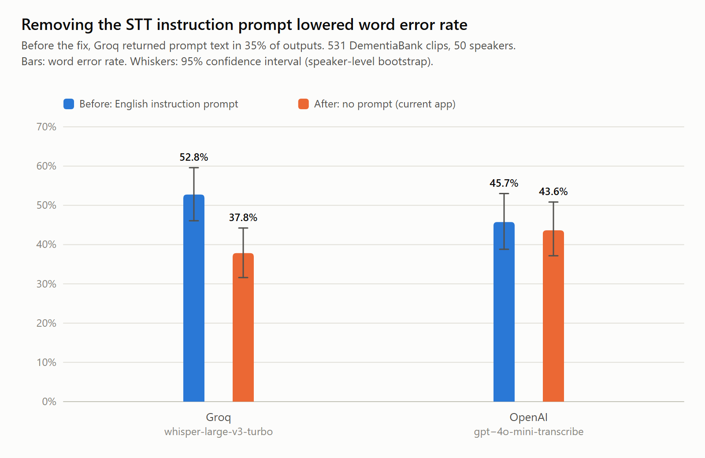
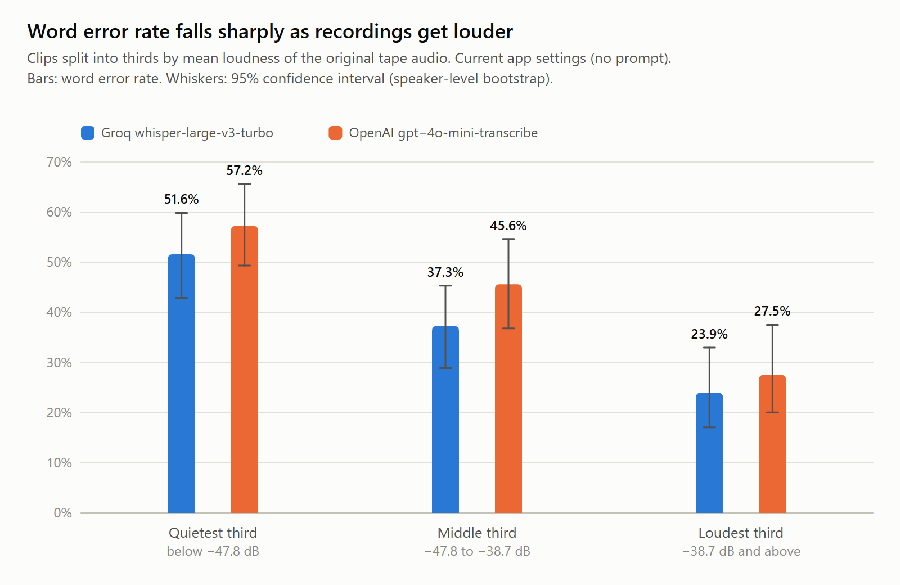
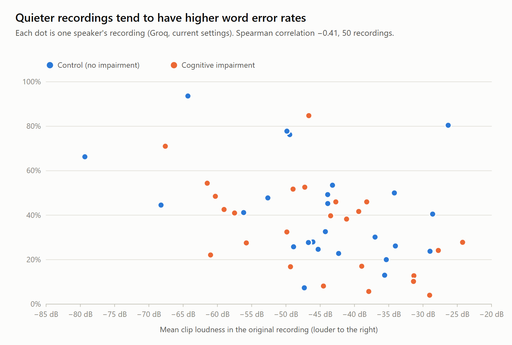
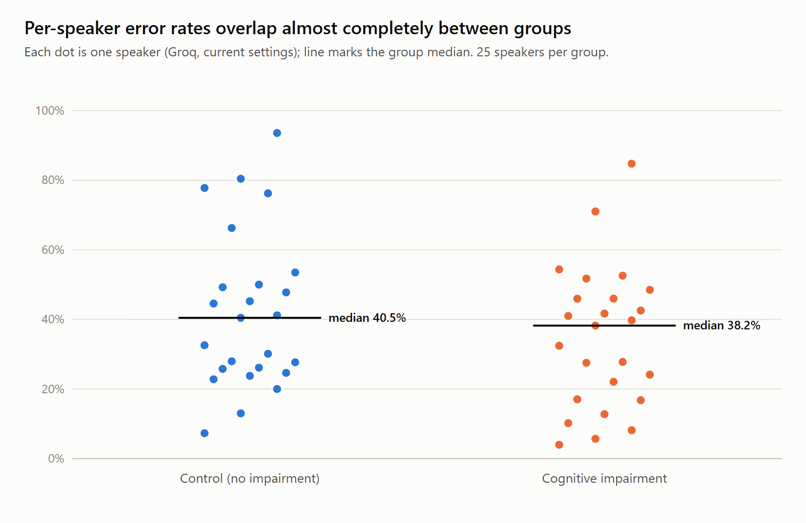
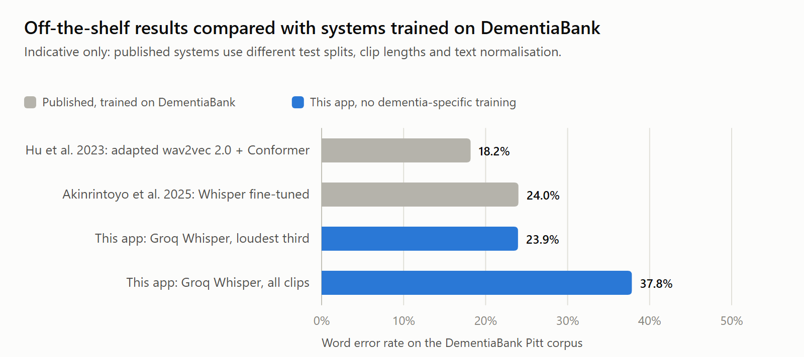

# Speech-to-text accuracy on DementiaBank (word error rate)

This evaluation measures how accurately the app's speech-to-text (STT) transcribes older adults with and without dementia. It sends patient speech from the DementiaBank Pitt corpus through the app's real `transcribeAudio` (`src/services/sttService.js`) and scores the output against the corpus's human transcripts using word error rate (WER). It covers both pipelines: Groq `whisper-large-v3-turbo` (free path) and OpenAI `gpt-4o-mini-transcribe` (fast path).

## Key findings

1. **On the clearest recordings, which are closest to app conditions, WER is about 24%, and the meaning is lost on only about 1 in 9 clips.** On the loudest third of clips, Groq scored 23.9% WER [17.1, 33.0], close to a Whisper model fine-tuned on this corpus (24%, [2]). 30% of clips were transcribed perfectly and 64% were perfect or had only minor slips (clip WER ≤ 25%). Only 11.3% lost their meaning (clip WER ≥ 75%), against 36.2% on the quietest third. A modern microphone with automatic gain should sound clearer still, so these figures are likely conservative for the app.
2. **Recording quality, not dementia, drives the overall error rate.** Across all clips WER is 37.8% (Groq), but it falls from 51.6% on the quietest third to 23.9% on the loudest. Per-speaker medians were almost the same for control and impaired speakers (40.5% vs 38.2%).
3. **The evaluation found and fixed a real bug.** The STT instruction prompt was being returned as the transcript ("Do not invent words for silence") in 35% of Groq outputs. Removing it cut Groq's WER by 14.9 points [12.1, 18.2].
4. **On transcription accuracy, Groq outperformed OpenAI on this dataset.** Groq's WER was 6.1 points lower [3.8, 8.6], and its median transcription latency was 250 ms against 797 ms. This is one input to the choice between the free and fast pipelines, not a verdict. The pipelines also differ in LLM response quality, TTS voice, end-to-end latency, cost and reliability, which are evaluated separately. The larger `whisper-large-v3` gave no accuracy improvement over the turbo model.

## Running it

DementiaBank data is licensed for research use only. Download the Pitt `.cha` transcripts and matching `.wav` audio from TalkBank into `evaluation/dementiabank/` (git-ignored). Each audio file must sit next to its transcript, e.g. `Pitt/Control/cookie/002-0.cha` and `002-0.wav`. Pitt reuses file names across groups and tasks, so audio is never matched across folders.

From `backend`:

```powershell
# Dry run: counts transcripts, audio, clips, recordings per group and skipped utterances. No API calls.
npm run eval:stt -- --providers groq,openai
# Small pilot spread across groups and recordings
npm run eval:stt -- --providers groq,openai --normalize --limit 40 --live
# The two runs reported below
npm run eval:stt -- --providers groq,openai --normalize --prompt legacy --label before --live
npm run eval:stt -- --providers groq,openai --normalize --label after --live
# Report tables, confidence intervals and loudness breakdown
node scripts/analyze-stt.js --runs <beforeRunId>,<afterRunId>
```

Options: `--data dir`, `--providers groq,openai`, `--speaker PAR`, `--min-ms 800`, `--max-ms 25000`, `--min-words 1`, `--delay-ms 3000`, `--limit N`, `--prompt legacy|<text>` (omit for the app's current behaviour), `--normalize`, `--label text`, `--out dir`. Live runs upload participant audio clips to the selected providers; confirm your data agreement allows this.

Each run writes `evaluation/results/TIMESTAMP-stt-ID/` (git-ignored, as it contains participant speech): `manifest.json` (settings, models, revision, clip counts), `rows.jsonl` (one row per clip and provider, written as it goes), `samples.csv` (reference and model output side by side) and `summary.csv`. `analyze-stt.js` writes `evaluation/results/analysis-<labels>/analysis.md` and `analysis.json`.

## Method

**Why DementiaBank rather than recordings from the app.** The ideal test set is people with dementia speaking to Aria through the app's own microphone path. The project does not currently have access to such recordings. Collecting them means recruiting people living with dementia, which needs ethics approval, consent procedures that account for varying capacity to consent, and secure handling of identifiable health-related audio. Each recording would also need a careful human transcript to score against. DementiaBank is an established, ethically collected research corpus with expert human transcripts and diagnostic labels, and it allows comparison with published work. The trade-off is that its archival tape audio differs from the app's recording conditions (see Limitations).

**Data.** Cookie Theft picture descriptions from the Pitt corpus: 50 recordings, one per participant. 25 are Control (no cognitive impairment). 25 are from the Dementia folder: 18 ProbableAD (probable Alzheimer's disease), 5 MCI (mild cognitive impairment) and 2 Memory (memory complaints). Diagnosis comes from each transcript's `@ID` line. Recordings were taken as the first 25 participants per folder in listing order, one visit each.

**Clips.** Each participant (`*PAR`) utterance with a media timestamp becomes one clip, cut from the recording with ffmpeg to 16 kHz mono WAV. Utterances shorter than 0.8 s, longer than 25 s, or with no scorable words were skipped. This gave 531 clips (Control 285, ProbableAD 187, MCI 43, Memory 16). The interviewer's turns are not scored. The app likewise receives one patient answer per recording.

**Reference text.** CHAT annotations are removed. The reference keeps everything the participant said, including repeated words and self-corrections, because STT models usually transcribe them. It drops fillers (uh, um), word fragments, unintelligible segments (`xxx`), pauses and event codes. Incomplete words written with omitted sounds, like `fallin(g)`, use the full word. A secondary *verbatim* WER also keeps fillers and fragments.

**Scoring.** Both texts are lowercased, punctuation is removed, numbers are spelled out, and contractions and casual spellings are expanded on both sides (`there's` → `there is`, `gonna` → `going to`, `outta` → `out of`). Generic noun + `'s` is left alone, since it may be possessive. WER = (substitutions + deletions + insertions) / reference words, totalled over clips, so longer utterances carry more weight. 95% confidence intervals use 2,000 bootstrap resamples of *speakers* rather than clips, because clips from one person are correlated. Before/after and Groq/OpenAI differences are paired by speaker over clips scored in both conditions.

**Conditions.** *Before*: the English instruction prompt the app used to send ("The speaker is speaking English, possibly with a strong accent… Do not invent words for silence or unclear audio."). *After*: no prompt, which is the app's current behaviour. Both runs apply loudness normalisation (`loudnorm`, −20 LUFS) to each clip. The archival tapes are far quieter than a modern browser microphone with automatic gain, and the trial showed the models fall back to prompt text on very quiet audio. Requests were sequential with 3 s pacing. Failed requests are logged and excluded from WER, and reported separately.

## Results

Runs: `before` = `2026-10-08T11-23-12-536Z-stt-80bd202b`, `after` = `2026-10-08T12-28-07-085Z-stt-758df49c`. 531 clips, 50 speakers, both providers.

### Overall

| Condition | Provider | WER [95% CI] | Clips perfect | Meaning lost (clip WER ≥ 75%) | Outputs containing prompt text | Failed requests | Median / p90 latency |
|---|---|---|---|---|---|---|---|
| Before (instruction prompt) | Groq | 52.8% [46.1, 59.6] | 14.7% | 42.4% | 187 (35%) | 0 | 258 / 362 ms |
| Before (instruction prompt) | OpenAI | 45.7% [38.8, 53.0] | 13.4% | 30.7% | 5 | 0 | 761 / 1068 ms |
| **After (no prompt)** | **Groq** | **37.8% [31.6, 44.2]** | 18.3% | 23.2% | 0 | 0 | 250 / 330 ms |
| **After (no prompt)** | **OpenAI** | **43.6% [37.2, 50.8]** | 14.7% | 30.8% | 0 | 8 (1.5%) | 797 / 1172 ms |

Paired differences (same speakers and clips):

- Removing the prompt reduced Groq WER by **14.9 points [12.1, 18.2]** and OpenAI WER by **1.8 points [0.3, 3.6]**.
- Without the prompt, Groq's WER was **6.1 points [3.8, 8.6] lower** than OpenAI's on this dataset, and its median transcription latency was about a third of OpenAI's. Latency here covers the STT request only, from a single run, not the full voice turn.

With the prompt, Groq returned the instruction text in place of, or mixed into, the speech for 35% of clips, e.g. "Do not invent words for silence." This would have reached the session as patient input. OpenAI rarely echoed the prompt. Without it, OpenAI's 8 failures were 2 timeouts (30 s limit) and 6 clips where it drifted into a non-Latin script twice. The app's English-script check catches these and asks the patient to record again rather than passing foreign text on. With the prompt, OpenAI had mis-transcribed all 6 of these clips too, mostly short or very quiet ones, including one returned as "I am speaking English."

Most errors are deletions (about 57% of errors after the change), then substitutions (about 39%) and few insertions (3–4%). The models mostly miss or mishear words rather than inventing extra ones, except in the prompt-echo failure above.

### Recording loudness dominates

| Clip loudness (original audio, thirds) | Groq after | OpenAI after |
|---|---|---|
| Quietest third (< −47.8 dB mean) | 51.6% [42.9, 59.9] | 57.2% [49.4, 65.6] |
| Middle third | 37.3% [28.9, 45.4] | 45.6% [36.8, 54.7] |
| Loudest third (≥ −38.7 dB mean) | **23.9% [17.1, 33.0]** | **27.5% [20.1, 37.5]** |

**Clear audio is transcribed well.** On the loudest third, the share of clips whose meaning was lost falls to roughly a third of the quietest-third rate, and most clips come back perfect or nearly so:

| Groq, after (177 clips per third) | Perfect | Perfect or minor slips (≤ 25%) | Meaning lost (≥ 75%) |
|---|---|---|---|
| Quietest third | 7% | 24% | 36.2% |
| Middle third | 18% | 41% | 22.0% |
| **Loudest third** | **30%** | **64%** | **11.3%** |

OpenAI follows the same pattern: 27% perfect and 14.4% meaning lost on the loudest third, against 47.7% lost on the quietest.

Per-recording WER ranged from 4% to 94% (Groq, after). It correlates with recording loudness (Spearman ρ ≈ −0.4 for both providers, 50 recordings). Clear recordings were transcribed almost perfectly; recordings near the tape noise floor were not, and normalisation cannot recover speech buried in hiss. Even the loudest third is quiet by modern standards, so the loudest-third figures are the closest estimate here to app conditions. They are still likely pessimistic for a modern microphone.

### Control vs cognitive impairment

| Provider (after) | Control (25 speakers) | ProbableAD (18) | All impaired (25) |
|---|---|---|---|
| Groq | 42.5% [33.1, 52.5] | 39.0% [31.1, 46.9] | 33.0% [25.0, 41.0] |
| OpenAI | 47.7% [38.1, 57.4] | 46.5% [39.1, 53.1] | 39.4% [31.4, 47.6] |

Median per-speaker WER was nearly identical (Groq: Control 40.5%, ProbableAD 41.0%), and the intervals overlap widely. Control's higher pooled WER comes from a few very poor recordings (one Control recording with 24 clips scored 76%). Control clips were also slightly quieter on average (−45.4 vs −43.8 dB). This sample shows no evidence that the models transcribe dementia speech worse than control speech; recording quality has a much larger effect. The MCI (5 speakers) and Memory (2) subgroups are too small to report separately.

### Model size

To test whether a larger model helps, the *after* condition was re-run on Groq with the full `whisper-large-v3` instead of `whisper-large-v3-turbo` (run `2026-10-08T14-27-20-978Z-stt-bb38eb09`, same 531 clips, no prompt, normalised).

| Groq model | WER [95% CI] | Loudest third | Meaning lost | Median latency |
|---|---|---|---|---|
| `whisper-large-v3-turbo` (app default) | 37.8% [31.6, 44.2] | 23.9% | 23.2% | 250 ms |
| `whisper-large-v3` | 38.9% [33.0, 44.8] | 25.3% | 24.3% | 200 ms |

Paired by speaker, the full model was 1.1 points worse [−0.6, 2.6]: no meaningful difference, and none within any group or loudness tier. The remaining errors are not fixed by model size, which is consistent with audio quality being the main limit. On accuracy alone, this gives no reason to switch from the turbo model. The latency difference is not meaningful, because the runs were two hours apart and provider load varies.

To repeat: set `GROQ_WHISPER_MODEL=whisper-large-v3` for the run, e.g. `$env:GROQ_WHISPER_MODEL='whisper-large-v3'; npm run eval:stt -- --providers groq --normalize --label after-large-v3 --live` in PowerShell. The manifest records the model used.

### Comparison with published results

The absolute WER is high, but in line with published work on this corpus. The best results come from systems trained or adapted on DementiaBank itself:

| System | Pitt WER | Source |
|---|---|---|
| TDNN/Conformer ASR with domain-adapted wav2vec 2.0 (lowest published) | 18.17% | Hu et al. 2023 [1] |
| Whisper medium fine-tuned on DementiaBank ("WhisperD") | 24% | Akinrintoyo et al. 2025 [2] |
| Conformer elderly-speech system, before its improvements | ≈39% (derived) | Wang et al. 2022 [3] |
| **This app, off-the-shelf Groq Whisper, no adaptation** | **37.8% (23.9% on loudest third)** | this evaluation |

The ≈39% figure is derived from [3]'s reported 13.6-point absolute (34.8% relative) reduction (13.6 / 0.348); the paper's baseline table should be checked before quoting it. [2] reports that off-the-shelf Whisper "fails to correctly transcribe dementia speech" and that the fine-tuned models significantly outperformed it. Its abstract does not give the off-the-shelf figure.

The comparison is indicative, not exact. Published systems use different test splits, often transcribe whole recordings rather than single utterances, and normalise references differently. This evaluation scores short utterance clips (often 1–3 s), which gives the model less context. The app's models also receive no dementia-specific adaptation.

### Figures

Generated from the analysis output into `evaluation/figures/` (SVG, plus 2× PNG when Edge or Chrome is installed). They contain aggregate numbers only:

```powershell
node scripts/plot-stt.js --analysis analysis-before-vs-after --after <afterRunId>
```

| File | Shows |
|---|---|
| `stt-wer-prompt-fix` | WER before/after removing the prompt, per provider, with 95% CIs |
| `stt-wer-by-loudness` | WER by loudness third, per provider |
| `stt-wer-vs-loudness-per-recording` | Per-recording WER against loudness, coloured by group (Groq) |
| `stt-wer-per-speaker-by-group` | Per-speaker WER for Control vs all impaired, with medians (40.5% vs 38.2%, Groq) |
| `stt-wer-vs-published` | This app against published DementiaBank results (indicative) |







### Why not use the published systems?

The two lower-WER systems above are not drop-in replacements for the app's STT. The main obstacles are availability, the training domain and licensing. Hosting is feasible but has costs.

- **Availability.** Neither is offered as a hosted service, and we could not confirm that the WhisperD weights have been publicly released. [1] is a research pipeline (TDNN/Conformer with domain-adapted wav2vec 2.0 and multi-pass decoding), not a drop-in model.
- **Hosting and latency.** Either would need to be self-hosted. The project has access to GPU hosting, so this is feasible, but it adds deployment, monitoring and maintenance that the hosted APIs avoid. Its latency would need measuring against the hosted path (median 250 ms for Groq here), since the app's turn-taking depends on fast responses. Multi-pass decoding, as in [1], is likely to be slower than single-pass Whisper.
- **Trained on the test conditions.** Their gains come partly from training on DementiaBank's own archival tape audio. The app records modern microphone audio, and an advantage learned on archival tape may not carry over to it; this has not been measured. On this evaluation's clearest third, the off-the-shelf model (23.9%) already matches WhisperD's 24%. WhisperD is also based on Whisper medium, a smaller model than the app's `whisper-large-v3-turbo`.
- **Licensing.** DementiaBank is licensed for research. Using a model trained on it in a product, even a prototype, needs checking against the data agreement. WhisperD also used an in-house dataset.
- **Speakers.** Both are tuned to older American-English speakers from one corpus. The app needs to handle a wider range of voices and accents.

The more promising route is to measure WER on real app recordings first. This was not possible in this evaluation, because the project does not yet have access to recordings of people with dementia using the app (see Method). It becomes possible once recordings can be collected with ethics approval and consent. A smaller interim step is recordings from consenting volunteers without dementia through the app. That would test the app's real microphone and recording path, though not dementia speech. If STT then turns out to be the bottleneck, a general Whisper model could be fine-tuned on consented recordings made through the app, which match the real microphone, task and speakers. The available GPU hosting makes both fine-tuning and serving such a model practical. Its accuracy and latency would then be compared with the hosted path using this same evaluation harness.

## Changes made because of this evaluation

- `sttService.js` no longer sends an English instruction prompt. English is still pinned with `language: 'en'`.
- The non-Latin-script check and retry, previously OpenAI only, now also covers Groq (retrying with `whisper-large-v3`). A transcript that drifts into another script twice is rejected with a request to record again, so it never reaches the session.

## Limitations

- **Archival audio.** 1980s–90s tape recordings are much quieter and noisier than a browser microphone. Absolute WER is likely pessimistic for the app. Archival data was used because recordings of people with dementia using the app are not yet available (see Method). The before/after and provider comparisons are more transferable than the absolute numbers.
- **Task and speakers.** Picture description by older American-English speakers, not conversational answers to Aria. The data cannot test accented speakers; the English pin and script check need separate testing with accented users.
- **Clip boundaries.** Clips are cut at human timestamps. In the app, recordings include leading and trailing silence, where models are known to hallucinate. This evaluation does not measure that.
- **Sample.** 50 speakers, one recording each, chosen by folder order rather than at random. ProbableAD has 18 speakers; MCI and Memory are too small to analyse. Confidence intervals account for clustering by speaker but not for the selection.
- **WER treats all errors equally.** "a" vs "the" counts the same as "yes" vs "no". "Meaning lost" (clip WER ≥ 75%) is a rough proxy, not a judgement of meaning. Reference transcripts keep participants' grammatical errors (e.g. "falled"), so a model that writes the intended word is marked wrong.
- **Single run per condition** on 8 October 2026, with an uncommitted working tree (see each `manifest.json`). Provider models may change over time.

## References

1. S. Hu et al., "Exploring Self-supervised Pre-trained ASR Models For Dysarthric and Elderly Speech Recognition," ICASSP 2023. arXiv:2302.14564. https://arxiv.org/abs/2302.14564
2. E. Akinrintoyo et al., "WhisperD: Dementia Speech Recognition and Filler Word Detection with Whisper," Interspeech 2025. arXiv:2505.21551. https://arxiv.org/abs/2505.21551
3. T. Wang et al., "Conformer Based Elderly Speech Recognition System for Alzheimer's Disease Detection," Interspeech 2022. arXiv:2206.13232. https://arxiv.org/abs/2206.13232

Check author lists and venues against the papers before final submission.

Suggested methods wording:

> We evaluated speech-to-text accuracy on 531 participant utterances from 50 speakers (25 control, 25 with cognitive impairment, including 18 with probable Alzheimer's disease) in the DementiaBank Pitt corpus Cookie Theft task. Utterances were cut at the corpus's timestamps, loudness-normalised and transcribed through the application's STT service using Groq whisper-large-v3-turbo and OpenAI gpt-4o-mini-transcribe. We computed word error rate against the human CHAT transcripts after removing fillers and fragments and normalising case, punctuation, numbers and contractions, with 95% confidence intervals from a speaker-level bootstrap (2,000 resamples). We compared the application's previous English instruction prompt with no prompt, pairing results by speaker.
